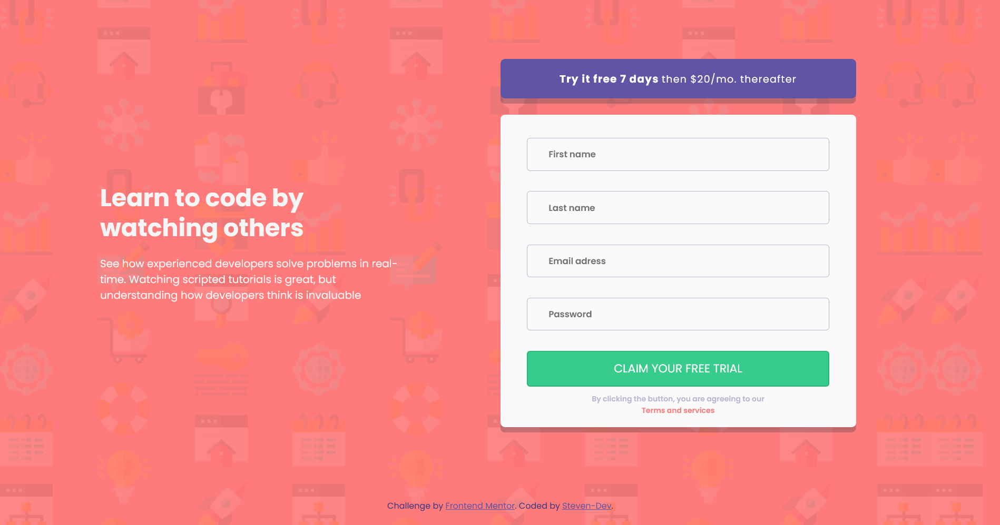

# Frontend Mentor - Intro component with sign up form solution

This is a solution to the [Intro component with sign up form challenge on Frontend Mentor](https://www.frontendmentor.io/challenges/intro-component-with-signup-form-5cf91bd49edda32581d28fd1). Frontend Mentor challenges help you improve your coding skills by building realistic projects.

This is my V2 for this project

## Table of contents

- [Overview](#overview)
  - [The challenge](#the-challenge)
  - [Screenshot](#screenshot)
  - [Links](#links)
- [My process](#my-process)
  - [Built with](#built-with)
  - [What I learned](#what-i-learned)
  - [Continued development](#continued-development)
- [Author](#author)

## Overview

### The challenge

Users should be able to:

- View the optimal layout for the site depending on their device's screen size
- See hover states for all interactive elements on the page
- Receive an error message when the `form` is submitted if:
  - Any `input` field is empty. The message for this error should say _"[Field Name] cannot be empty"_
  - The email address is not formatted correctly (i.e. a correct email address should have this structure: `name@host.tld`). The message for this error should say _"Looks like this is not an email"_

### Screenshot

### Links

- Solution URL: [Github code](https://github.com/Stv-devl/V2---intro-component-with-signup-form-master-)
- Live Site URL: [You can see here](https://stv-devl.github.io/V2---intro-component-with-signup-form-master-/)

## My process

### Built with

- Semantic HTML5 markup
- CSS custom properties
- Flexbox
- CSS Grid
- Mobile-first workflow
- SASS
- Javascript

### What I learned

This is the version 2 of the project.

For complete the form :

- The firstname should have between 3 and 20 characters. The first name must not contain special characters
- The Lastname should have between 3 and 20 characters. The first name must not contain special characters
- Email should be a valid adress email
- Passord should have a minimum of 8 characters, one capital letter, one number and one special character. We have a progress-bar for see if the password is strong.

The error messages are display when we writting. The progress-bar also.

When we validate if it's good we get a thank you message. If its wrong we get an please complete the form correctly message.

### Continued development

Maybe more form and more complex work.

## Author

- Website - [Github](https://github.com/Stv-devl)
- Frontend Mentor - [@Stv-devl](https://www.frontendmentor.io/profile/Stv-devl)
